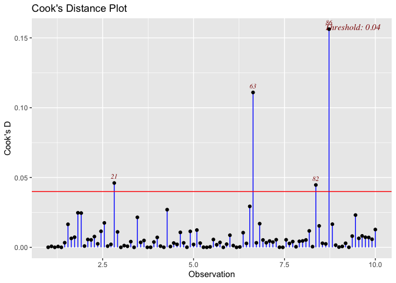

<!-- README.md is generated from README.Rmd. Please edit that file -->

# Disclaimer

This software is part of the DATA501 2024 course taught a Victoria
University in Wellington, and is intended for educational purposes only.

# OutlierDetection

<!-- badges: start -->
<!-- badges: end -->

The goal of `OutlierDetection` is to calculate measure of influence
which helps to user to detect potential outliers.

## Installation

You can install the development version of `OutlierDetection` like so:

``` r
devtools::install_github("DavidHuijser/DATA501OutlierDetection",build_vignettes=TRUE )
```

Once you successfully installed `OutlierDetection` you can add it to
your library using the following command:

``` r
library(OutlierDetection)  
```

## Manual and Vignette

This allows you to view the general vignette using command

``` r
browseVignettes("OutlierDetection")
```

The function available to the user is `InfluenceMeasure` in the next
section you will see an example, however if you prefer you can find the
manual using either

``` r
?InfluenceMeasure
```

or

``` r
help(InfluenceMeasure)
```

## Example

This is a basic example which shows you how to solve a common problem:

``` r
library(OutlierDetection)
slope <-  4
offset <- -3
sds <- 7
x <- seq(from = 1, to = 10, length.out= 100)

y <- slope*x + offset

# Add regular noise
noise <- rnorm(length(x),sd=2)
y <- y + noise

# generate number of outliers
num <- 3
s <- sample(length(x), num)
y[s] <- y[s] +  rnorm(num, sd=sds) + runif(num, -sds,sds)

# Create plot
df <- data.frame(x,y)
lin_model <- lm(y~x)


InfluenceMeasure(lin_model, measure="Cooks", output = "values")
#>   [1] 3.179252e-03 9.547546e-04 9.262940e-04 1.021569e-02 1.681670e-02
#>   [6] 1.974302e-02 1.256959e-02 8.692167e-03 6.850795e-05 3.108465e-02
#>  [11] 7.101899e-05 1.932912e-04 8.694039e-03 6.508028e-03 1.771323e-03
#>  [16] 4.162743e-03 6.039233e-04 6.262797e-05 4.705956e-05 1.210793e-02
#>  [21] 2.715134e-03 1.658644e-03 6.713333e-04 4.255099e-06 3.331911e-04
#>  [26] 6.536974e-04 1.753795e-03 7.529034e-06 4.207884e-03 8.832049e-03
#>  [31] 9.423194e-03 5.463266e-03 4.376284e-05 2.504083e-06 3.475342e-02
#>  [36] 3.458355e-05 1.077126e-02 4.588166e-04 7.766397e-03 2.944559e-03
#>  [41] 5.621955e-04 7.861686e-05 2.975557e-03 2.252082e-03 1.978818e-02
#>  [46] 1.721643e-04 8.480545e-04 1.649200e-04 1.209063e-02 3.553259e-04
#>  [51] 1.684268e-03 8.095414e-03 1.340781e-03 5.718519e-03 1.066328e-03
#>  [56] 1.958581e-03 5.446303e-03 5.853466e-05 1.227604e-02 1.047414e-02
#>  [61] 2.638137e-04 3.415406e-03 1.142415e-01 8.923028e-04 9.579706e-05
#>  [66] 4.829317e-05 6.025282e-04 6.019608e-05 3.808342e-02 1.248362e-02
#>  [71] 1.144427e-02 1.045364e-02 1.096707e-02 4.268291e-03 1.350989e-02
#>  [76] 8.194702e-04 1.139623e-02 3.378558e-05 1.038728e-02 8.353502e-03
#>  [81] 1.893716e-02 1.685712e-02 3.212686e-02 3.828278e-03 1.580632e-02
#>  [86] 3.570584e-03 4.388663e-02 6.882997e-03 4.849481e-03 7.710688e-02
#>  [91] 5.566716e-03 8.832953e-03 7.510488e-04 9.079458e-03 1.431666e-02
#>  [96] 1.395778e-02 9.062190e-04 7.432683e-02 1.521469e-05 4.239871e-03
InfluenceMeasure(lin_model, measure="Cooks", output = "plot")
```


