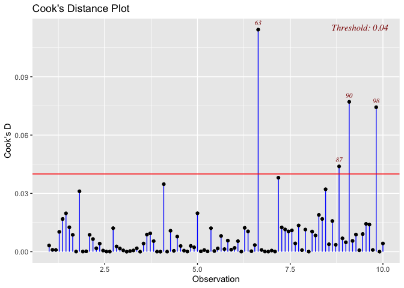

<!-- README.md is generated from README.Rmd. Please edit that file -->

# Disclaimer

This software is part of the DATA501 2024 course taught a Victoria
University in Wellington, and is intended for educational purposes only.

# OutlierDetection

<!-- badges: start -->
<!-- badges: end -->

The goal of `OutlierDetection` is to calculate measure of influence
which helps to user to detect potential outliers.

## Installation

You can install the development version of `OutlierDetection` like so:

``` r
devtools::install_github("DavidHuijser/DATA501OutlierDetection",build_vignettes=TRUE )
```

Once you successfully installed `OutlierDetection` you can add it to
your library using the following command:

``` r
library(OutlierDetection)  
```

## Manual and Vignette

This allows you to view the general vignette using command:

``` r
browseVignettes("OutlierDetection")
```

The result of the might be dependent on the specific setup of your
computer and `R` environment.

The function available to the user is `InfluenceMeasure`. In the next
section you will see an example, however if you prefer you can find the
manual using either

``` r
?InfluenceMeasure
```

or

``` r
help(InfluenceMeasure)
```

in the `R` console.

## Example

This is a basic example which shows you how to solve a common problem:

``` r
library(OutlierDetection)
slope <-  4
offset <- -3
sds <- 7
x <- seq(from = 1, to = 10, length.out= 100)

y <- slope*x + offset

# Add regular noise
noise <- rnorm(length(x),sd=2)
y <- y + noise

# generate number of outliers
num <- 3
s <- sample(length(x), num)
y[s] <- y[s] +  rnorm(num, sd=sds) + runif(num, -sds,sds)

# Create plot
df <- data.frame(x,y)
lin_model <- lm(y~x)


InfluenceMeasure(lin_model, measure="Cooks", output = "values")
#>   [1] 5.334333e-04 1.168629e-03 7.373411e-03 6.994626e-03 1.504222e-03
#>   [6] 5.808109e-04 4.819459e-03 2.726681e-03 2.159947e-04 4.833923e-03
#>  [11] 3.607923e-03 1.451041e-02 5.173781e-04 3.343512e-03 3.222487e-02
#>  [16] 1.995394e-03 1.411238e-02 1.336144e-02 3.074767e-03 1.691115e-03
#>  [21] 1.202118e-03 3.661405e-04 4.759483e-04 2.083959e-02 6.750456e-03
#>  [26] 1.604011e-04 7.730882e-03 3.205220e-03 1.026723e-03 1.288758e-02
#>  [31] 6.345465e-04 9.464559e-04 1.155548e-02 7.174582e-03 7.243373e-03
#>  [36] 1.043378e-03 3.440740e-04 6.501002e-04 8.456620e-03 1.005736e-02
#>  [41] 4.035316e-03 4.114429e-03 1.833013e-03 1.536594e-04 6.332916e-03
#>  [46] 4.328897e-03 6.463434e-06 2.046358e-03 8.864563e-06 2.829643e-03
#>  [51] 1.973802e-02 4.497663e-03 7.437066e-04 6.959504e-03 1.183653e-02
#>  [56] 3.801201e-03 3.330092e-03 8.526638e-03 3.358805e-04 1.127302e-02
#>  [61] 1.770438e-03 1.115274e-03 1.995056e-04 6.697206e-03 4.952162e-03
#>  [66] 1.077865e-03 1.957692e-02 1.270117e-02 2.733381e-03 6.449612e-09
#>  [71] 1.722082e-08 9.083096e-04 7.495947e-03 9.706806e-04 1.705061e-03
#>  [76] 1.604908e-01 1.935800e-05 7.058819e-05 2.049103e-05 1.598342e-02
#>  [81] 1.999877e-05 7.507781e-04 1.264730e-04 1.903596e-02 4.332397e-03
#>  [86] 6.961645e-03 2.971383e-01 1.620239e-02 1.110967e-02 9.231047e-03
#>  [91] 6.920746e-03 4.485460e-04 2.031384e-02 1.248617e-03 2.096902e-03
#>  [96] 7.181197e-04 1.242136e-02 3.555571e-03 7.335880e-03 1.154332e-04
InfluenceMeasure(lin_model, measure="Cooks", output = "plot")
```


